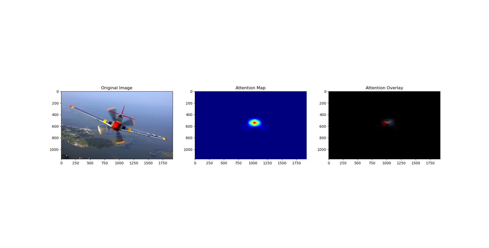

# Vision Transformer Attention Visualization

This repository contains code for visualizing attention matrices in a Vision Transformer model using PyTorch. The code demonstrates how to calculate attention matrices for the last layer and for each head in the Vision Transformer.

## Contents
- `ViT_DINO_Explainability_phenotyping.py`: This file contains code snippets for calculating attention matrices in a Vision Transformer model. It includes functions for getting attention for the last layer and for each head, as well as code for visualizing the attention maps.

## Functionality
- `get_attn_last_layer`: This function calculates the attention matrix for the last layer of a Vision Transformer based on hidden features, query key weights, and query key biases.
- `get_attn_for_heads`: This function calculates attention matrices for each head in the Vision Transformer based on hidden features, query key weights, query key biases, and the number of encoder blocks.

## Visualization
The code includes visualization steps for displaying the attention overlay on the original image using matplotlib and OpenCV. It also applies Gaussian filtering and interpolation to enhance the visualization of the attention maps.

## Usage
To use the code, follow the instructions provided in the code comments and run the code in a Python environment with the necessary dependencies installed.

Feel free to explore and modify the code to suit your specific requirements for visualizing attention in Vision Transformer models.

## Results

We visualize the at the first image the attention map of the last layer, and the other image is showing the map we got after getting the mean over the attention heads in the last layer

**We can see there is a variation in the visualzation based on the mathematical operation we would use over the attention maps. We will introduce attnention rollout next as a better technique to be able to explain the transfomer behaviour**

**TBD**. Attnetion rollout technique
